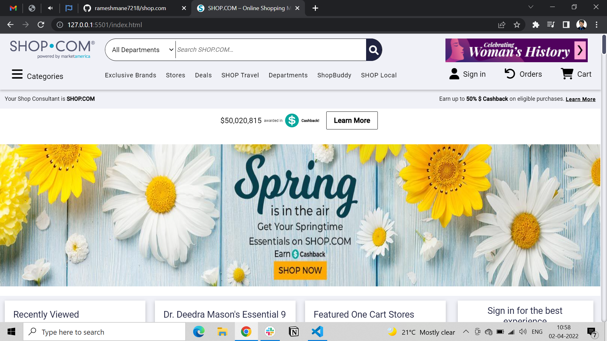
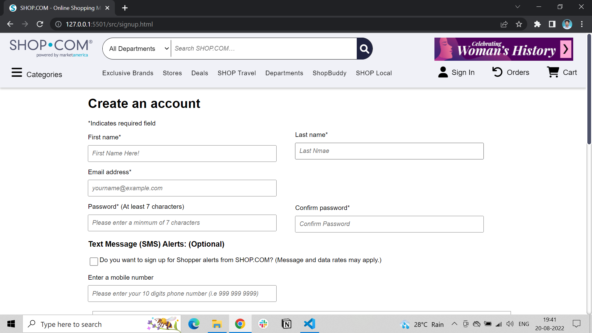

# “shop.com” Website Clone

### SHOP.COM is a new kind of shopping comparison site that offers the most comprehensive shopping experience on the web.

This is our first project at Masai School using JavaScript, HTML, and CSS. We worked on “Shop.com”, an online shopping store.

## Technologies we used

1. We used HTML-5 and CSS-3 for front-end
2. Javascript for back-end
3. Localstorage is used for the data-storing purpose (as we are not introduced to the databases till now)

## Screenshots

### Homepage -

This is our home page were we tried to build the same page as it is visible in the main website and also adding some styles to look better, and linking the other pages to the home page.

### Navigation bar and Footer -

If the user clicks on the SignUp/login or any other option page it shows the pages of that section.

### Sign up / Sign in Page -

On this page, if the user is already registered, you can simply sign in by providing valid details of the user otherwise you can register a user by clicking on create your new accout.

### Products Page -

Here users can browse and add items to the cart by clicking on the Add to Cart button.

### Cart Page -

Here all the products added to the cart will be shown. On this page, you can also remove the items. By clicking on the “Proceed to Checkout” button you will be redirected to the checkout page.

### Payment Page -

On this page, users can add their address details and add their payment details.

By providing these details users can send OTP and after OTP varification user will get notification of order placed.

